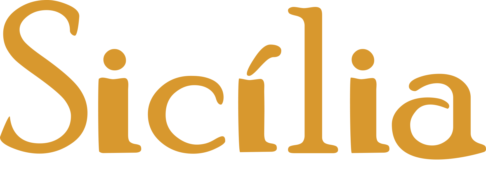
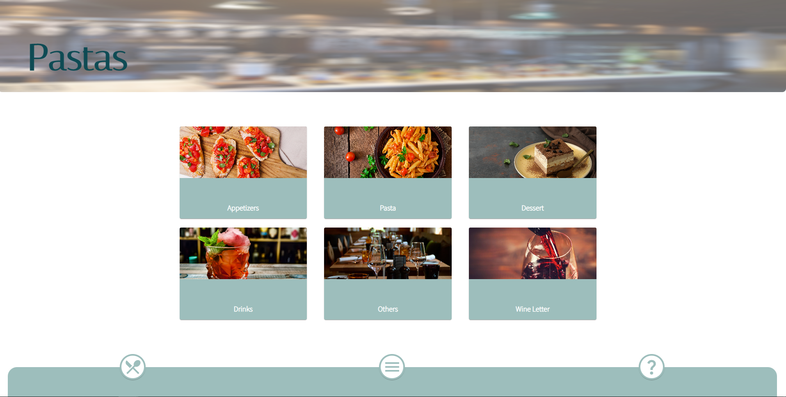
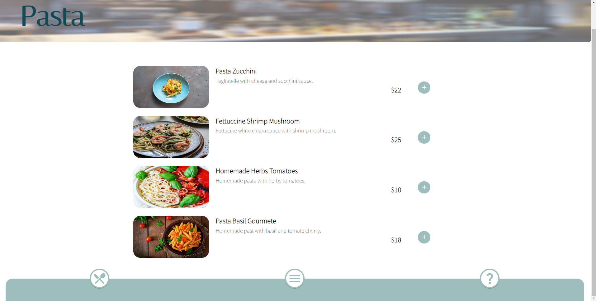
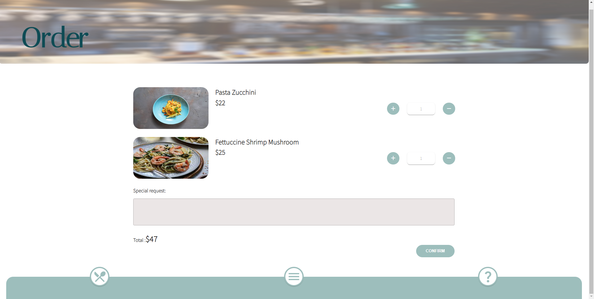

# Sicília

Um app para receber pedidos de um restaurante focado em reduzir
as equipes de trabalho no salão.

## O Projeto
Esse projeto é uma releitura do seu layout original de um app feito pela UX/UI Design <a href="https://www.linkedin.com/in/gabrielevaler/">Gabriele Valerio</a>.
Esse projeto teve como objetivo construir um app para receber os pedidos do restaurante direto da mesa
reduzindo a equipe em trabalhos no salão, diminuindo o tempo de espera do cliente para realizar o pedido e
oferecendo uma experiência inovadora.

## :hammer: Funcionalidades do projeto

- Visualização de opções no menu;
- Visualização de opções de uma opção especifica do menu com imagem e descrição;
- Visualização de pedido;
- Visualização de ajuda;
- Seleção de quantidade de opções ao realizar pedido;
- Confirmação de pedido, detalhe do pedido, quantidade e soma de total dos selecionados;

## ⚙️ Novas funcionalidades mapeadas
- Integração com API propria.
- Adição de novas opções de menus;

### 🔧 Instalação
Essas instruções permitirão que você obtenha uma cópia do projeto em operação na sua máquina local para fins de desenvolvimento e teste.

Clone este repositório. Você precisará de `node` e `npm` ou `yarn` instalados globalmente em sua máquina.
De prefêrencia a instalação do node na versão 14.15.0, onde você pode encontrar por esse link <a href="https://nodejs.org/ja/blog/release/v14.15.0/">clique aqui</a>.

Instalação:

`npm install` ou `npm install --global yarn`

Para iniciar o servidor:

`npm start` ou `yarn start` 

Para visitar o aplicativo:

`localhost:3000/`

## 🛠️ Construído com

* [React](https://pt-br.reactjs.org/) - O framework web usado.
* [TypeScript](https://www.typescriptlang.org/) - TypeScript é JavaScript com sintaxe para tipos. 
* [styled-components](https://styled-components.com/) - Estilização com JS e CSS.
* [MUI](https://mui.com/pt/) - Biblioteca de componentes.

## ✒️ Autores

Mencione todos aqueles que ajudaram a levantar o projeto desde o seu início

* **Renan Brickes** - *Desenvolvedor* - [LinkedIn](https://www.linkedin.com/in/renan-brickes-822717140/)
* **Gabriele Valerio** - *UX/UI Design* - [LinkedIn](https://www.linkedin.com/in/gabrielevaler/)
